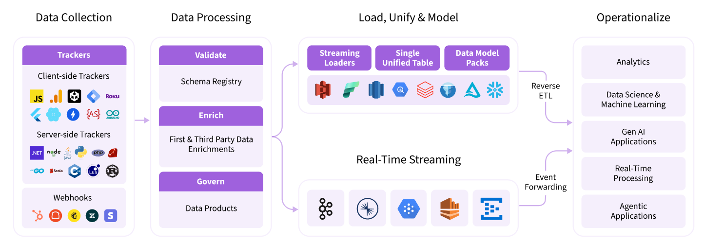

[![Snowplow logo][logo-image]][website]

---

Welcome to Snowplow, the leader in next-generation customer data infrastructure (CDI), enabling every data-driven organization to own and unlock the value of its customer behavioral data to fuel AI, advanced analytics, and personalized experiences from their central data platform.

Thousands of organizations like Burberry, Strava, and Auto Trader rely on Snowplow to collect, manage, and operationalize real-time event data from their central data platform to uncover deeper customer journey insights, predict customer behaviors, deliver differentiated customer experiences, and detect fraudulent activities.

### Why next-gen CDI?​

Snowplow is built from the ground up to not only lay the foundation for an organization's advanced analytics use cases, but to also power machine learning and AI use cases, including those powered by generative AI.

Key benefits of Snowplow’s next-gen CDI:
* Data depth and quality
* Centralized data governance
* Real-time operationalization
* Privacy and compliance
* AI and BI-ready behavioral data

### Why Snowplow?

* “Glass-box” technical architecture capable of processing billions of events per day
* **Over [20 SDKs](https://docs.snowplow.io/docs/collecting-data/collecting-from-own-applications?utm_source=github&utm_content=main-repo)** to collect data from web, mobile, server-side, and other sources
* A unique approach based on **[schemas and validation](https://docs.snowplow.io/docs/understanding-tracking-design/understanding-schemas-and-validation?utm_source=github&utm_content=main-repo)** ensures your data is as clean as possible
* **Over [15 enrichments](https://docs.snowplow.io/docs/enriching-your-data/available-enrichments?utm_source=github&utm_content=main-repo)** to get the most out of your data
* Stream data to your data warehouse/lakehouse or SaaS destinations of choice

Our [documentation](https://docs.snowplow.io/docs?utm_source=github&utm_content=main-repo) is a great place to learn more.

This repository contains the major Snowplow components as individual submodule repositories.

---

### Community

Check out our [Community](https://community.snowplow.io/) for support and updates.

If you spot a bug, please raise an issue in the GitHub repository of the component in question.

---

### Copyright and license

Copyright 2012-2025 Snowplow Analytics Ltd.

Snowplow components are licensed differently depending on their purpose. Read about our different licenses [here](https://docs.snowplow.io/docs/resources/copyright-license?utm_source=github&utm_content=main-repo).

[logo-image]: media/snowplow_logo.png
[website]: https://snowplow.io/
